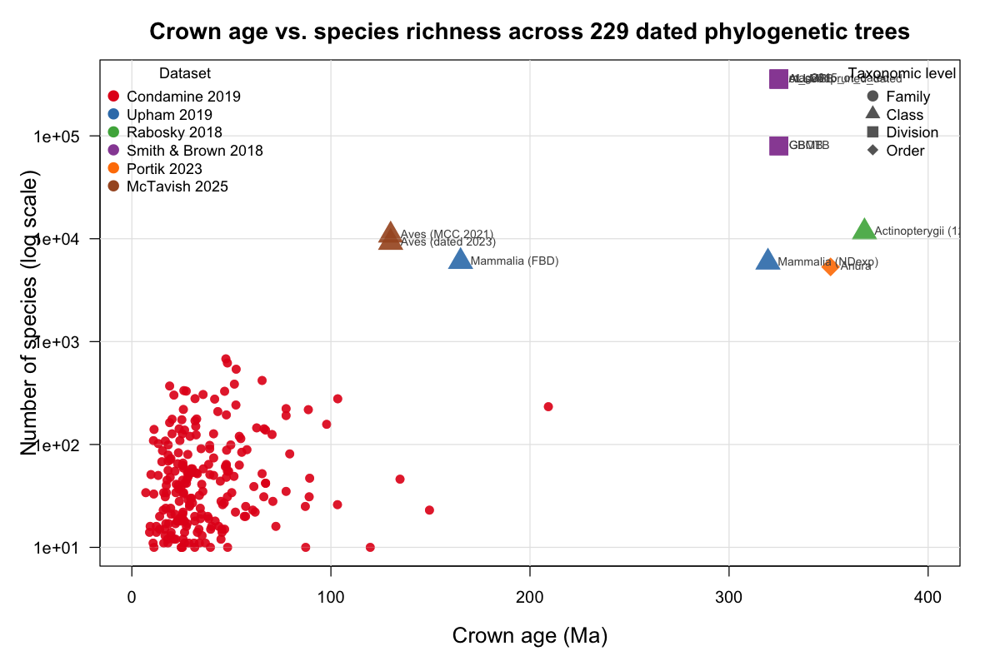

# Phylogenetic Tree Collection

A curated collection of published, empirical phylogenetic trees inferred from
molecular data. All trees have **species as leaves** and come from peer-reviewed
studies widely used in comparative biology.

**325 tree files** across 26 studies covering mammals, birds, frogs, fish, squamates,
amphibians, seed plants, butterflies, ferns, corals, insects, sharks, bacteria,
archaea, bees, spiders, turtles, primates, crustaceans, bryophytes, nematodes,
echinoderms, and all of life (Open Tree of Life).

## Quick start

```bash
# Clone the repo (includes 218 Condamine family trees + documentation)
git clone https://github.com/franciscorichter/phylo-datasets.git
cd phylo_trees

# Download the larger trees from their original sources
bash download_trees.sh
```

The Condamine et al. 2019 family-level trees (218 trees, 1.4 MB) are included
directly in this repository. All other datasets are downloaded from their
original sources by the script to respect data hosting and citation metrics.

## Crown age vs. species richness



Crown age (Ma) vs. number of species for 230 time-calibrated trees in the
collection. Red circles: Condamine 2019 family-level trees. Triangles, squares,
and diamonds: class/division/order-level trees from other studies.

---

## Table of Contents

1. [Mammals -- Upham et al. 2019](#1-mammals----upham-et-al-2019)
2. [Birds -- Jetz et al. 2012](#2-birds----jetz-et-al-2012)
3. [Birds -- McTavish et al. 2025](#3-birds----mctavish-et-al-2025)
4. [Frogs -- Portik et al. 2023](#4-frogs----portik-et-al-2023)
5. [Ray-finned Fish -- Rabosky et al. 2018](#5-ray-finned-fish----rabosky-et-al-2018)
6. [Seed Plants -- Smith & Brown 2018](#6-seed-plants----smith--brown-2018)
7. [Tetrapod Families -- Condamine et al. 2019](#7-tetrapod-families----condamine-et-al-2019)
8. [Amphibians -- Jetz & Pyron 2018](#8-amphibians-all-species----jetz--pyron-2018)
9. [Squamates -- Pyron 2013 & Tonini 2016](#9-squamates----pyron-et-al-2013--tonini-et-al-2016)
10. [Butterflies -- Kawahara et al. 2023](#10-butterflies----kawahara-et-al-2023)
11. [Ferns -- Nitta et al. 2022](#11-ferns----nitta-et-al-2022)
12. [Corals -- 2025](#12-corals----2025)
13. [Insects -- Chesters 2017 & 2023](#13-insects----chesters-2017--2023)
14. [Sharks & Rays -- Stein et al. 2018](#14-sharks--rays----stein-et-al-2018)
15. [Bacteria & Archaea -- GTDB 2025](#15-bacteria--archaea----gtdb-2025)
16. [Bees -- BeeTree of Life 2023](#16-bees----beetree-of-life-2023)
17. [Spiders -- Garrison et al. 2016](#17-spiders----garrison-et-al-2016)
18. [Turtles -- Thomson et al. 2021](#18-turtles----thomson-et-al-2021)
19. [Primates -- 10kTrees Version 3](#19-primates----10ktrees-version-3)
20. [Crustaceans -- Wolfe et al. 2019](#20-crustaceans----wolfe-et-al-2019)
21. [Bryophytes -- Bechteler et al. 2023](#21-bryophytes----bechteler-et-al-2023)
22. [Nematodes -- 2025 Systematic Biology](#22-nematodes----2025-systematic-biology)
23. [Echinoderms -- Mongiardino Koch & Thompson 2022](#23-echinoderms----mongiardino-koch--thompson-2022)
24. [Insects (insectphylo.org) -- Chesters 2023-2026](#24-insects-insectphyloorg----chesters-2023-2026)
25. [Open Tree of Life v16.1](#25-open-tree-of-life-v161)
26. [Summary](#summary)
27. [Reading Trees in R and Python](#reading-trees-in-r-and-python)

---

## 1. Mammals -- Upham et al. 2019

**3 files | 27 MB**

**Citation:** Upham NS, Esselstyn JA, Jetz W. 2019. Inferring the mammal tree: species-level sets of phylogenies for questions in ecology, evolution, and conservation. PLOS Biology 17(12): e3000494. https://doi.org/10.1371/journal.pbio.3000494

**Source:** https://github.com/n8upham/MamPhy_v1

**Methods:** DNA supermatrix (31 genes) from GenBank. Bayesian inference (MrBayes) with backbone-and-patch approach. All 5,911 extant mammal species + 1 outgroup.

| File | Description | Format | Tips |
|------|-------------|--------|------|
| `mammals/upham2019_mammal_MCC_5911sp.tre` | MCC tree, node-dated (NDexp) | Nexus | 5,912 |
| `mammals/upham2019_mammal_FBD_MCC_5911sp.tre` | MCC tree, FBD-dated | Nexus | 5,912 |
| `mammals/upham2019_mammal_100posterior_5911sp.trees` | 100 posterior samples (NDexp) | Nexus | 5,912 x 100 trees |

**Full posterior (10,000 trees):** Dryad https://datadryad.org/dataset/doi:10.5061/dryad.tb03d03

---

## 2. Birds -- Jetz et al. 2012

**1 file | 442 MB**

**Citation:** Jetz W, Thomas GH, Joy JB, Hartmann K, Mooers AO. 2012. The global diversity of birds in space and time. Nature 491: 444-448. https://doi.org/10.1038/nature11631

**Source:** https://birdtree.org / https://data.vertlife.org/birdtree/

**Methods:** DNA supermatrix from GenBank + Hackett et al. 2008 backbone. Bayesian (BEAST), taxonomic imputation. 1,000 trees from pseudo-posterior (Stage 2).

| File | Description | Format | Tips |
|------|-------------|--------|------|
| `birds/AllBirdsHackett1.tre` | Posterior distribution, Hackett backbone | Newick | 9,993 x 1,000 trees |

**Additional:** 10 sets of 1,000 trees at https://data.vertlife.org/birdtree/Stage2/HackettStage2_XXXX_YYYY.zip

---

## 3. Birds -- McTavish et al. 2025

**4 files | 2.6 MB**

**Citation:** McTavish EJ et al. 2025. A complete and dynamic tree of birds. PNAS. https://doi.org/10.1073/pnas.2409658122

**Source:** https://github.com/McTavishLab/AvesData

**Methods:** Open Tree synthesis algorithm uniting 262 studies (1990-2024). Tips aligned to Clements taxonomy (eBird). Updated annually.

| File | Description | Format | Tips |
|------|-------------|--------|------|
| `birds/mctavish2025/MCC_clements2021.tre` | MCC tree, Clements 2021 taxonomy | Newick | 10,824 |
| `birds/mctavish2025/phylo_dated_clements2022.tre` | Time-calibrated, Clements 2022 | Newick | 9,184 |
| `birds/mctavish2025/phylo_dated_clements2023.tre` | Time-calibrated, Clements 2023 | Newick | 9,183 |
| `birds/mctavish2025/labelled_supertree_Jetz_backbone.tre` | Supertree with Jetz backbone | Newick | 19,302 |

---

## 4. Frogs -- Portik et al. 2023

**3 files | 23 MB**

**Citation:** Portik DM, Streicher JW, Wiens JJ. 2023. Frog phylogeny: a time-calibrated, species-level tree based on hundreds of loci and 5,242 species. Molecular Phylogenetics and Evolution 188: 107907. https://doi.org/10.1016/j.ympev.2023.107907

**Source:** https://github.com/nhm-herpetology/frog-phylogeny

**Methods:** Supermatrix with up to 307 loci per species. RAxML ML inference, time-calibrated with treePL. Largest frog phylogeny to date.

| File | Description | Format | Tips |
|------|-------------|--------|------|
| `amphibians/portik2023_frog_timetree_5242sp.tre` | Time-calibrated tree | Newick | 5,326 |
| `amphibians/portik2023_frog_raxml_best.tre` | RAxML best ML tree with bootstrap | Newick | 5,326 |
| `amphibians/portik2023_frog_100bootstrap_5242sp.tre` | 100 bootstrap time trees | Newick | 5,326 x 100 trees |

---

## 5. Ray-finned Fish -- Rabosky et al. 2018

**3 files | 162 MB**

**Citation:** Rabosky DL et al. 2018. An inverse latitudinal gradient in speciation rate for marine fishes. Nature 559: 392-395. https://doi.org/10.1038/s41586-018-0273-1

**Source:** https://fishtreeoflife.org/downloads/

**Methods:** 27-gene supermatrix, 130 fossil calibrations. Full trees (31,516 spp.) include stochastic polytomy resolution and taxonomic imputation.

| File | Description | Format | Tips |
|------|-------------|--------|------|
| `fish/actinopt_12k_raxml.tre` | RAxML ML phylogram | Newick | 11,638 |
| `fish/actinopt_12k_treePL.tre` | Time-calibrated (treePL) | Newick | 11,638 |
| `fish/actinopt_full.trees` | Full chronograms, all ray-finned fish | Newick | 31,516 x 100 trees |

---

## 6. Seed Plants -- Smith & Brown 2018

**6 files | 43 MB**

**Citation:** Smith SA, Brown JW. 2018. Constructing a broadly inclusive seed plant phylogeny. American Journal of Botany 105(3): 302-314. https://doi.org/10.1002/ajb2.1019

**Source:** https://github.com/FePhyFoFum/big_seed_plant_trees/releases/tag/v0.1

**Methods:** 7 gene regions (atpB, ITS, matK, ndhF, rbcL, trnL-F, 26S). ~80K species with molecular data extended to ~356K via taxonomy. RAxML ML, treePL dating.

| File | Description | Format | Tips |
|------|-------------|--------|------|
| `plants/ALLMB.tre` | All taxa, molecular backbone scaffold | Newick | 356,305 |
| `plants/ALLOTB.tre` | All taxa, Open Tree backbone scaffold | Newick | 353,185 |
| `plants/GBMB.tre` | GenBank taxa only, molecular scaffold | Newick | 79,874 |
| `plants/GBOTB.tre` | GenBank taxa only, Open Tree scaffold | Newick | 79,881 |
| `plants/mag2015_ot_dated.tre` | Dated (Magallon 2015 calibrations) | Newick | 359,536 |
| `plants/ot_seedpruned_dated.tre` | Dated, OT-pruned | Newick | 356,670 |

---

## 7. Tetrapod Families -- Condamine et al. 2019

**218 files | 1.4 MB**

**Citation:** Condamine FL, Rolland J, Morlon H. 2019. Assessing the causes of diversification slowdowns: temperature-dependent and diversity-dependent models receive equivalent support. Ecology Letters 22: 1900-1912. https://doi.org/10.1111/ele.13356

**Source:** https://figshare.com/articles/dataset/9555842

218 family-level time-calibrated phylogenies of tetrapods. All Newick format, branch lengths in millions of years. One tree per file, named by family. Compiled from multiple published molecular phylogenies.

### Amphibians (10 families)

| File | Description | Format | Tips |
|------|-------------|--------|------|
| `condamine/condamine2019_slowdowns/amphibia/Alsodidae.tre` | Alsodidae | Newick | 20 |
| `condamine/condamine2019_slowdowns/amphibia/Alytidae.tre` | Alytidae | Newick | 10 |
| `condamine/condamine2019_slowdowns/amphibia/Bombinatoridae.tre` | Bombinatoridae | Newick | 10 |
| `condamine/condamine2019_slowdowns/amphibia/Caecilidae.tre` | Caecilidae | Newick | 31 |
| `condamine/condamine2019_slowdowns/amphibia/Eleutherodactylidae.tre` | Eleutherodactylidae | Newick | 145 |
| `condamine/condamine2019_slowdowns/amphibia/Hynobiidae.tre` | Hynobiidae | Newick | 46 |
| `condamine/condamine2019_slowdowns/amphibia/Pipidae.tre` | Pipidae | Newick | 23 |
| `condamine/condamine2019_slowdowns/amphibia/Plethodontidae.tre` | Plethodontidae | Newick | 278 |
| `condamine/condamine2019_slowdowns/amphibia/Ranidae.tre` | Ranidae | Newick | 218 |
| `condamine/condamine2019_slowdowns/amphibia/Salamandridae.tre` | Salamandridae | Newick | 42 |

### Birds (129 families)

| File | Description | Format | Tips |
|------|-------------|--------|------|
| `condamine/condamine2019_slowdowns/bird/Acanthizidae.tre` | Acanthizidae | Newick | 63 |
| `condamine/condamine2019_slowdowns/bird/Accipitridae.tre` | Accipitridae | Newick | 242 |
| `condamine/condamine2019_slowdowns/bird/Acrocephalidae.tre` | Acrocephalidae | Newick | 52 |
| `condamine/condamine2019_slowdowns/bird/Aegithalidae.tre` | Aegithalidae | Newick | 10 |
| `condamine/condamine2019_slowdowns/bird/Alaudidae.tre` | Alaudidae | Newick | 91 |
| `condamine/condamine2019_slowdowns/bird/Alcedinidae.tre` | Alcedinidae | Newick | 91 |
| `condamine/condamine2019_slowdowns/bird/Alcidae.tre` | Alcidae | Newick | 23 |
| `condamine/condamine2019_slowdowns/bird/Anatidae.tre` | Anatidae | Newick | 157 |
| `condamine/condamine2019_slowdowns/bird/Apodidae.tre` | Apodidae | Newick | 99 |
| `condamine/condamine2019_slowdowns/bird/Ardeidae.tre` | Ardeidae | Newick | 61 |
| `condamine/condamine2019_slowdowns/bird/Artamidae.tre` | Artamidae | Newick | 11 |
| `condamine/condamine2019_slowdowns/bird/Bernieridae.tre` | Bernieridae | Newick | 11 |
| `condamine/condamine2019_slowdowns/bird/Bucconidae.tre` | Bucconidae | Newick | 35 |
| `condamine/condamine2019_slowdowns/bird/Bucerotidae.tre` | Bucerotidae | Newick | 55 |
| `condamine/condamine2019_slowdowns/bird/Cacatuidae.tre` | Cacatuidae | Newick | 21 |
| `condamine/condamine2019_slowdowns/bird/Campephagidae.tre` | Campephagidae | Newick | 80 |
| `condamine/condamine2019_slowdowns/bird/Capitonidae.tre` | Capitonidae | Newick | 14 |
| `condamine/condamine2019_slowdowns/bird/Caprimulgidae.tre` | Caprimulgidae | Newick | 88 |
| `condamine/condamine2019_slowdowns/bird/Cardinalidae.tre` | Cardinalidae | Newick | 68 |
| `condamine/condamine2019_slowdowns/bird/Certhiidae.tre` | Certhiidae | Newick | 10 |
| `condamine/condamine2019_slowdowns/bird/Cettiidae.tre` | Cettiidae | Newick | 32 |
| `condamine/condamine2019_slowdowns/bird/Charadriidae.tre` | Charadriidae | Newick | 64 |
| `condamine/condamine2019_slowdowns/bird/Chloropseidae.tre` | Chloropseidae | Newick | 11 |
| `condamine/condamine2019_slowdowns/bird/Ciconiidae.tre` | Ciconiidae | Newick | 19 |
| `condamine/condamine2019_slowdowns/bird/Cisticolidae.tre` | Cisticolidae | Newick | 142 |
| `condamine/condamine2019_slowdowns/bird/Columbidae.tre` | Columbidae | Newick | 306 |
| `condamine/condamine2019_slowdowns/bird/Conopophagidae.tre` | Conopophagidae | Newick | 11 |
| `condamine/condamine2019_slowdowns/bird/Coraciidae.tre` | Coraciidae | Newick | 12 |
| `condamine/condamine2019_slowdowns/bird/Corvidae.tre` | Corvidae | Newick | 120 |
| `condamine/condamine2019_slowdowns/bird/Cotingidae.tre` | Cotingidae | Newick | 65 |
| `condamine/condamine2019_slowdowns/bird/Cracidae.tre` | Cracidae | Newick | 50 |
| `condamine/condamine2019_slowdowns/bird/Cracticidae.tre` | Cracticidae | Newick | 12 |
| `condamine/condamine2019_slowdowns/bird/Cuculidae.tre` | Cuculidae | Newick | 138 |
| `condamine/condamine2019_slowdowns/bird/Dicaeidae.tre` | Dicaeidae | Newick | 45 |
| `condamine/condamine2019_slowdowns/bird/Dicruridae.tre` | Dicruridae | Newick | 24 |
| `condamine/condamine2019_slowdowns/bird/Diomedeidae.tre` | Diomedeidae | Newick | 21 |
| `condamine/condamine2019_slowdowns/bird/Emberizidae.tre` | Emberizidae | Newick | 163 |
| `condamine/condamine2019_slowdowns/bird/Estrildidae.tre` | Estrildidae | Newick | 140 |
| `condamine/condamine2019_slowdowns/bird/Eurylaimidae.tre` | Eurylaimidae | Newick | 20 |
| `condamine/condamine2019_slowdowns/bird/Falconidae.tre` | Falconidae | Newick | 64 |
| `condamine/condamine2019_slowdowns/bird/Formicariidae.tre` | Formicariidae | Newick | 12 |
| `condamine/condamine2019_slowdowns/bird/Fringillidae.tre` | Fringillidae | Newick | 194 |
| `condamine/condamine2019_slowdowns/bird/Furnariidae.tre` | Furnariidae | Newick | 302 |
| `condamine/condamine2019_slowdowns/bird/Galbulidae.tre` | Galbulidae | Newick | 18 |
| `condamine/condamine2019_slowdowns/bird/Glareolidae.tre` | Glareolidae | Newick | 17 |
| `condamine/condamine2019_slowdowns/bird/Grallariidae.tre` | Grallariidae | Newick | 49 |
| `condamine/condamine2019_slowdowns/bird/Gruidae.tre` | Gruidae | Newick | 15 |
| `condamine/condamine2019_slowdowns/bird/Haematopodidae.tre` | Haematopodidae | Newick | 11 |
| `condamine/condamine2019_slowdowns/bird/Hirundinidae.tre` | Hirundinidae | Newick | 83 |
| `condamine/condamine2019_slowdowns/bird/Hydrobatidae.tre` | Hydrobatidae | Newick | 22 |
| `condamine/condamine2019_slowdowns/bird/Icteridae.tre` | Icteridae | Newick | 102 |
| `condamine/condamine2019_slowdowns/bird/Indicatoridae.tre` | Indicatoridae | Newick | 17 |
| `condamine/condamine2019_slowdowns/bird/Laniidae.tre` | Laniidae | Newick | 29 |
| `condamine/condamine2019_slowdowns/bird/Laridae.tre` | Laridae | Newick | 99 |
| `condamine/condamine2019_slowdowns/bird/Leiothrichidae.tre` | Leiothrichidae | Newick | 127 |
| `condamine/condamine2019_slowdowns/bird/Locustellidae.tre` | Locustellidae | Newick | 53 |
| `condamine/condamine2019_slowdowns/bird/Lybiidae.tre` | Lybiidae | Newick | 41 |
| `condamine/condamine2019_slowdowns/bird/Macrosphenidae.tre` | Macrosphenidae | Newick | 18 |
| `condamine/condamine2019_slowdowns/bird/Malaconotidae.tre` | Malaconotidae | Newick | 46 |
| `condamine/condamine2019_slowdowns/bird/Maluridae.tre` | Maluridae | Newick | 27 |
| `condamine/condamine2019_slowdowns/bird/Megalaimidae.tre` | Megalaimidae | Newick | 28 |
| `condamine/condamine2019_slowdowns/bird/Megapodiidae.tre` | Megapodiidae | Newick | 21 |
| `condamine/condamine2019_slowdowns/bird/Melanocharitidae.tre` | Melanocharitidae | Newick | 10 |
| `condamine/condamine2019_slowdowns/bird/Meliphagidae.tre` | Meliphagidae | Newick | 177 |
| `condamine/condamine2019_slowdowns/bird/Meropidae.tre` | Meropidae | Newick | 26 |
| `condamine/condamine2019_slowdowns/bird/Mimidae.tre` | Mimidae | Newick | 34 |
| `condamine/condamine2019_slowdowns/bird/Momotidae.tre` | Momotidae | Newick | 10 |
| `condamine/condamine2019_slowdowns/bird/Monarchidae.tre` | Monarchidae | Newick | 87 |
| `condamine/condamine2019_slowdowns/bird/Motacillidae.tre` | Motacillidae | Newick | 62 |
| `condamine/condamine2019_slowdowns/bird/Muscicapidae.tre` | Muscicapidae | Newick | 279 |
| `condamine/condamine2019_slowdowns/bird/Musophagidae.tre` | Musophagidae | Newick | 23 |
| `condamine/condamine2019_slowdowns/bird/Nectariniidae.tre` | Nectariniidae | Newick | 127 |
| `condamine/condamine2019_slowdowns/bird/Odontophoridae.tre` | Odontophoridae | Newick | 34 |
| `condamine/condamine2019_slowdowns/bird/Oriolidae.tre` | Oriolidae | Newick | 30 |
| `condamine/condamine2019_slowdowns/bird/Otididae.tre` | Otididae | Newick | 25 |
| `condamine/condamine2019_slowdowns/bird/Pachycephalidae.tre` | Pachycephalidae | Newick | 50 |
| `condamine/condamine2019_slowdowns/bird/Paradisaeidae.tre` | Paradisaeidae | Newick | 40 |
| `condamine/condamine2019_slowdowns/bird/Paridae.tre` | Paridae | Newick | 53 |
| `condamine/condamine2019_slowdowns/bird/Parulidae.tre` | Parulidae | Newick | 109 |
| `condamine/condamine2019_slowdowns/bird/Passeridae.tre` | Passeridae | Newick | 48 |
| `condamine/condamine2019_slowdowns/bird/Pellorneidae.tre` | Pellorneidae | Newick | 66 |
| `condamine/condamine2019_slowdowns/bird/Petroicidae.tre` | Petroicidae | Newick | 44 |
| `condamine/condamine2019_slowdowns/bird/Phalacrocoracidae.tre` | Phalacrocoracidae | Newick | 33 |
| `condamine/condamine2019_slowdowns/bird/Phasianidae.tre` | Phasianidae | Newick | 176 |
| `condamine/condamine2019_slowdowns/bird/Phylloscopidae.tre` | Phylloscopidae | Newick | 71 |
| `condamine/condamine2019_slowdowns/bird/Picidae.tre` | Picidae | Newick | 223 |
| `condamine/condamine2019_slowdowns/bird/Pipridae.tre` | Pipridae | Newick | 52 |
| `condamine/condamine2019_slowdowns/bird/Pittidae.tre` | Pittidae | Newick | 31 |
| `condamine/condamine2019_slowdowns/bird/Platysteiridae.tre` | Platysteiridae | Newick | 30 |
| `condamine/condamine2019_slowdowns/bird/Ploceidae.tre` | Ploceidae | Newick | 108 |
| `condamine/condamine2019_slowdowns/bird/Podargidae.tre` | Podargidae | Newick | 15 |
| `condamine/condamine2019_slowdowns/bird/Podicipedidae.tre` | Podicipedidae | Newick | 19 |
| `condamine/condamine2019_slowdowns/bird/Polioptilidae.tre` | Polioptilidae | Newick | 15 |
| `condamine/condamine2019_slowdowns/bird/Procellariidae.tre` | Procellariidae | Newick | 81 |
| `condamine/condamine2019_slowdowns/bird/Prunellidae.tre` | Prunellidae | Newick | 13 |
| `condamine/condamine2019_slowdowns/bird/Psittacidae.tre` | Psittacidae | Newick | 330 |
| `condamine/condamine2019_slowdowns/bird/Psophodidae.tre` | Psophodidae | Newick | 13 |
| `condamine/condamine2019_slowdowns/bird/Pteroclidae.tre` | Pteroclidae | Newick | 16 |
| `condamine/condamine2019_slowdowns/bird/Ptilonorhynchidae.tre` | Ptilonorhynchidae | Newick | 19 |
| `condamine/condamine2019_slowdowns/bird/Pycnonotidae.tre` | Pycnonotidae | Newick | 124 |
| `condamine/condamine2019_slowdowns/bird/Rallidae.tre` | Rallidae | Newick | 125 |
| `condamine/condamine2019_slowdowns/bird/Ramphastidae.tre` | Ramphastidae | Newick | 35 |
| `condamine/condamine2019_slowdowns/bird/Remizidae.tre` | Remizidae | Newick | 12 |
| `condamine/condamine2019_slowdowns/bird/Rhinocryptidae.tre` | Rhinocryptidae | Newick | 53 |
| `condamine/condamine2019_slowdowns/bird/Rhipiduridae.tre` | Rhipiduridae | Newick | 42 |
| `condamine/condamine2019_slowdowns/bird/Scolopacidae.tre` | Scolopacidae | Newick | 89 |
| `condamine/condamine2019_slowdowns/bird/Sittidae.tre` | Sittidae | Newick | 24 |
| `condamine/condamine2019_slowdowns/bird/Spheniscidae.tre` | Spheniscidae | Newick | 18 |
| `condamine/condamine2019_slowdowns/bird/Strigidae.tre` | Strigidae | Newick | 191 |
| `condamine/condamine2019_slowdowns/bird/Sturnidae.tre` | Sturnidae | Newick | 109 |
| `condamine/condamine2019_slowdowns/bird/Sulidae.tre` | Sulidae | Newick | 10 |
| `condamine/condamine2019_slowdowns/bird/Sylviidae.tre` | Sylviidae | Newick | 62 |
| `condamine/condamine2019_slowdowns/bird/Thamnophilidae.tre` | Thamnophilidae | Newick | 219 |
| `condamine/condamine2019_slowdowns/bird/Thraupidae.tre` | Thraupidae | Newick | 370 |
| `condamine/condamine2019_slowdowns/bird/Threskiornithidae.tre` | Threskiornithidae | Newick | 34 |
| `condamine/condamine2019_slowdowns/bird/Timaliidae.tre` | Timaliidae | Newick | 55 |
| `condamine/condamine2019_slowdowns/bird/Tinamidae.tre` | Tinamidae | Newick | 47 |
| `condamine/condamine2019_slowdowns/bird/Tityridae.tre` | Tityridae | Newick | 41 |
| `condamine/condamine2019_slowdowns/bird/Trochilidae.tre` | Trochilidae | Newick | 334 |
| `condamine/condamine2019_slowdowns/bird/Troglodytidae.tre` | Troglodytidae | Newick | 79 |
| `condamine/condamine2019_slowdowns/bird/Trogonidae.tre` | Trogonidae | Newick | 42 |
| `condamine/condamine2019_slowdowns/bird/Turdidae.tre` | Turdidae | Newick | 170 |
| `condamine/condamine2019_slowdowns/bird/Turnicidae.tre` | Turnicidae | Newick | 16 |
| `condamine/condamine2019_slowdowns/bird/Tyrannidae.tre` | Tyrannidae | Newick | 419 |
| `condamine/condamine2019_slowdowns/bird/Tytonidae.tre` | Tytonidae | Newick | 15 |
| `condamine/condamine2019_slowdowns/bird/Vangidae.tre` | Vangidae | Newick | 21 |
| `condamine/condamine2019_slowdowns/bird/Viduidae.tre` | Viduidae | Newick | 20 |
| `condamine/condamine2019_slowdowns/bird/Vireonidae.tre` | Vireonidae | Newick | 58 |
| `condamine/condamine2019_slowdowns/bird/Zosteropidae.tre` | Zosteropidae | Newick | 120 |

### Crocodilians & Turtles (2 families)

| File | Description | Format | Tips |
|------|-------------|--------|------|
| `condamine/condamine2019_slowdowns/crocoturtle/Crocodylia.tre` | Crocodylia | Newick | 25 |
| `condamine/condamine2019_slowdowns/crocoturtle/Testudines.tre` | Testudines | Newick | 233 |

### Mammals (66 families)

| File | Description | Format | Tips |
|------|-------------|--------|------|
| `condamine/condamine2019_slowdowns/mammal/Atelidae.tre` | Atelidae | Newick | 24 |
| `condamine/condamine2019_slowdowns/mammal/Bathyergidae.tre` | Bathyergidae | Newick | 14 |
| `condamine/condamine2019_slowdowns/mammal/Bovidae.tre` | Bovidae | Newick | 138 |
| `condamine/condamine2019_slowdowns/mammal/Canidae.tre` | Canidae | Newick | 34 |
| `condamine/condamine2019_slowdowns/mammal/Capromyidae.tre` | Capromyidae | Newick | 14 |
| `condamine/condamine2019_slowdowns/mammal/Caviidae.tre` | Caviidae | Newick | 16 |
| `condamine/condamine2019_slowdowns/mammal/Cebidae.tre` | Cebidae | Newick | 48 |
| `condamine/condamine2019_slowdowns/mammal/Cercopithecidae.tre` | Cercopithecidae | Newick | 127 |
| `condamine/condamine2019_slowdowns/mammal/Cervidae.tre` | Cervidae | Newick | 45 |
| `condamine/condamine2019_slowdowns/mammal/Cheirogaleidae.tre` | Cheirogaleidae | Newick | 15 |
| `condamine/condamine2019_slowdowns/mammal/Chrysochloridae.tre` | Chrysochloridae | Newick | 17 |
| `condamine/condamine2019_slowdowns/mammal/Cricetidae.tre` | Cricetidae | Newick | 620 |
| `condamine/condamine2019_slowdowns/mammal/Ctenomyidae.tre` | Ctenomyidae | Newick | 51 |
| `condamine/condamine2019_slowdowns/mammal/Dasypodidae.tre` | Dasypodidae | Newick | 20 |
| `condamine/condamine2019_slowdowns/mammal/Dasyproctidae.tre` | Dasyproctidae | Newick | 13 |
| `condamine/condamine2019_slowdowns/mammal/Dasyuridae.tre` | Dasyuridae | Newick | 63 |
| `condamine/condamine2019_slowdowns/mammal/Delphinidae.tre` | Delphinidae | Newick | 34 |
| `condamine/condamine2019_slowdowns/mammal/Didelphidae.tre` | Didelphidae | Newick | 84 |
| `condamine/condamine2019_slowdowns/mammal/Dipodidae.tre` | Dipodidae | Newick | 51 |
| `condamine/condamine2019_slowdowns/mammal/Echimyidae.tre` | Echimyidae | Newick | 69 |
| `condamine/condamine2019_slowdowns/mammal/Emballonuridae.tre` | Emballonuridae | Newick | 49 |
| `condamine/condamine2019_slowdowns/mammal/Erethizontidae.tre` | Erethizontidae | Newick | 14 |
| `condamine/condamine2019_slowdowns/mammal/Erinaceidae.tre` | Erinaceidae | Newick | 22 |
| `condamine/condamine2019_slowdowns/mammal/Felidae.tre` | Felidae | Newick | 40 |
| `condamine/condamine2019_slowdowns/mammal/Galagidae.tre` | Galagidae | Newick | 18 |
| `condamine/condamine2019_slowdowns/mammal/Geomyidae.tre` | Geomyidae | Newick | 38 |
| `condamine/condamine2019_slowdowns/mammal/Gliridae.tre` | Gliridae | Newick | 27 |
| `condamine/condamine2019_slowdowns/mammal/Herpestidae.tre` | Herpestidae | Newick | 33 |
| `condamine/condamine2019_slowdowns/mammal/Heteromyidae.tre` | Heteromyidae | Newick | 58 |
| `condamine/condamine2019_slowdowns/mammal/Hipposideridae.tre` | Hipposideridae | Newick | 74 |
| `condamine/condamine2019_slowdowns/mammal/Hylobatidae.tre` | Hylobatidae | Newick | 14 |
| `condamine/condamine2019_slowdowns/mammal/Hystricidae.tre` | Hystricidae | Newick | 11 |
| `condamine/condamine2019_slowdowns/mammal/Indriidae.tre` | Indriidae | Newick | 10 |
| `condamine/condamine2019_slowdowns/mammal/Lemuridae.tre` | Lemuridae | Newick | 19 |
| `condamine/condamine2019_slowdowns/mammal/Leporidae.tre` | Leporidae | Newick | 58 |
| `condamine/condamine2019_slowdowns/mammal/Macropodidae.tre` | Macropodidae | Newick | 56 |
| `condamine/condamine2019_slowdowns/mammal/Macroscelididae.tre` | Macroscelididae | Newick | 15 |
| `condamine/condamine2019_slowdowns/mammal/Mephitidae.tre` | Mephitidae | Newick | 12 |
| `condamine/condamine2019_slowdowns/mammal/Molossidae.tre` | Molossidae | Newick | 98 |
| `condamine/condamine2019_slowdowns/mammal/Muridae.tre` | Muridae | Newick | 680 |
| `condamine/condamine2019_slowdowns/mammal/Mustelidae.tre` | Mustelidae | Newick | 59 |
| `condamine/condamine2019_slowdowns/mammal/Nesomyidae.tre` | Nesomyidae | Newick | 55 |
| `condamine/condamine2019_slowdowns/mammal/Nycteridae.tre` | Nycteridae | Newick | 16 |
| `condamine/condamine2019_slowdowns/mammal/Ochotonidae.tre` | Ochotonidae | Newick | 28 |
| `condamine/condamine2019_slowdowns/mammal/Octodontidae.tre` | Octodontidae | Newick | 10 |
| `condamine/condamine2019_slowdowns/mammal/Otariidae.tre` | Otariidae | Newick | 16 |
| `condamine/condamine2019_slowdowns/mammal/Peramelidae.tre` | Peramelidae | Newick | 17 |
| `condamine/condamine2019_slowdowns/mammal/Petauridae.tre` | Petauridae | Newick | 11 |
| `condamine/condamine2019_slowdowns/mammal/Phalangeridae.tre` | Phalangeridae | Newick | 22 |
| `condamine/condamine2019_slowdowns/mammal/Phocidae.tre` | Phocidae | Newick | 18 |
| `condamine/condamine2019_slowdowns/mammal/Phyllostomidae.tre` | Phyllostomidae | Newick | 150 |
| `condamine/condamine2019_slowdowns/mammal/Pitheciidae.tre` | Pitheciidae | Newick | 37 |
| `condamine/condamine2019_slowdowns/mammal/Procyonidae.tre` | Procyonidae | Newick | 14 |
| `condamine/condamine2019_slowdowns/mammal/Pseudocheiridae.tre` | Pseudocheiridae | Newick | 16 |
| `condamine/condamine2019_slowdowns/mammal/Pteropodidae.tre` | Pteropodidae | Newick | 174 |
| `condamine/condamine2019_slowdowns/mammal/Rhinolophidae.tre` | Rhinolophidae | Newick | 73 |
| `condamine/condamine2019_slowdowns/mammal/Sciuridae.tre` | Sciuridae | Newick | 276 |
| `condamine/condamine2019_slowdowns/mammal/Soricidae.tre` | Soricidae | Newick | 329 |
| `condamine/condamine2019_slowdowns/mammal/Spalacidae.tre` | Spalacidae | Newick | 31 |
| `condamine/condamine2019_slowdowns/mammal/Suidae.tre` | Suidae | Newick | 18 |
| `condamine/condamine2019_slowdowns/mammal/Talpidae.tre` | Talpidae | Newick | 39 |
| `condamine/condamine2019_slowdowns/mammal/Tenrecidae.tre` | Tenrecidae | Newick | 25 |
| `condamine/condamine2019_slowdowns/mammal/Tupaiidae.tre` | Tupaiidae | Newick | 19 |
| `condamine/condamine2019_slowdowns/mammal/Vespertilionidae.tre` | Vespertilionidae | Newick | 386 |
| `condamine/condamine2019_slowdowns/mammal/Viverridae.tre` | Viverridae | Newick | 34 |
| `condamine/condamine2019_slowdowns/mammal/Ziphiidae.tre` | Ziphiidae | Newick | 20 |

### Squamates (11 families)

| File | Description | Format | Tips |
|------|-------------|--------|------|
| `condamine/condamine2019_slowdowns/squamate/Chamaeleonidae.tre` | Chamaeleonidae | Newick | 142 |
| `condamine/condamine2019_slowdowns/squamate/Colubridae.tre` | Colubridae | Newick | 539 |
| `condamine/condamine2019_slowdowns/squamate/Cordylidae.tre` | Cordylidae | Newick | 42 |
| `condamine/condamine2019_slowdowns/squamate/Crotaphytidae.tre` | Crotaphytidae | Newick | 11 |
| `condamine/condamine2019_slowdowns/squamate/Gerrhosauridae.tre` | Gerrhosauridae | Newick | 28 |
| `condamine/condamine2019_slowdowns/squamate/Iguanidae.tre` | Iguanidae | Newick | 31 |
| `condamine/condamine2019_slowdowns/squamate/Phrynosomatidae.tre` | Phrynosomatidae | Newick | 114 |
| `condamine/condamine2019_slowdowns/squamate/Pythonidae.tre` | Pythonidae | Newick | 26 |
| `condamine/condamine2019_slowdowns/squamate/Varanidae.tre` | Varanidae | Newick | 53 |
| `condamine/condamine2019_slowdowns/squamate/Viperidae.tre` | Viperidae | Newick | 209 |
| `condamine/condamine2019_slowdowns/squamate/Xantusiidae.tre` | Xantusiidae | Newick | 26 |

---

## 8. Amphibians (all species) -- Jetz & Pyron 2018

**2 files**

**Citation:** Jetz W, Pyron RA. 2018. The interplay of past diversification and evolutionary isolation with present imperilment across the amphibian tree of life. *Nature Ecology & Evolution* 2: 850-858. https://doi.org/10.1038/s41559-018-0515-5

**Dryad:** https://datadryad.org/stash/dataset/doi:10.5061/dryad.cc3n6j5

| File | Format | Tips | Description |
|------|--------|------|-------------|
| `amphibians/jetz_pyron_2018_consensus_7238sp.tre` | Newick | 7,239 | Consensus of 10,000 posterior trees (time-calibrated, crown 342.6 Ma) |
| `amphibians/jetz_pyron_2018_ML_4061sp.tre` | Newick | 4,062 | ML tree from 15-gene alignment (data species only) |

**Methods:** 15-gene supermatrix, Bayesian inference with taxonomic imputation for data-deficient species.

**Note:** Requires manual download from Dryad (browser authentication). 10 posterior sets of 1,000 trees each (~140 MB each) also available.

---

## 9. Squamates -- Pyron et al. 2013 & Tonini et al. 2016

**4 files**

**Citation (Pyron):** Pyron RA, Burbrink FT, Wiens JJ. 2013. A phylogeny and revised classification of Squamata, including 4161 species of lizards and snakes. *BMC Evolutionary Biology* 13: 93. https://doi.org/10.1186/1471-2148-13-93

**Dryad:** https://datadryad.org/dataset/doi:10.5061/dryad.82h0m

**Citation (Tonini):** Tonini JFR, Beard KH, Ferreira RB, Jetz W, Pyron RA. 2016. Fully-sampled phylogenies of squamates reveal evolutionary patterns in threat status. *Biological Conservation* 204: 23-31. https://doi.org/10.1016/j.biocon.2016.03.039

**Dryad:** https://datadryad.org/stash/dataset/doi:10.5061/dryad.db005

| File | Format | Tips | Description |
|------|--------|------|-------------|
| `squamates/pyron2013_squamate_4161sp.tre` | Newick | 4,162 | ML tree with species names |
| `squamates/pyron2013_squamate_4161sp_nolabels.tre` | Newick | 4,162 | ML tree with OTT labels |
| `squamates/tonini2016_squamate_consensus_9755sp.tre` | Newick | 9,755 | Consensus tree (time-calibrated, crown 242.8 Ma) |
| `squamates/tonini2016_squamate_ML.tre` | Newick | 5,416 | ML tree (data species only) |

**Methods (Pyron):** 12-gene supermatrix (12,896 bp), ML inference. **Methods (Tonini):** Extended to all 9,755 species via taxonomic imputation.

**Note:** Requires manual download from Dryad. Tonini posterior sets (10 x 1,000 trees, ~456 MB each) also available.

---

## 10. Butterflies -- Kawahara et al. 2023

**3 files | 3.7 MB**

**Citation:** Kawahara AY et al. 2023. A global phylogeny of butterflies reveals their evolutionary history, ancestral hosts and biogeographic origins. *Nature Ecology & Evolution* 7: 903-913. https://doi.org/10.1038/s41559-023-02041-9

**Source:** https://doi.org/10.6084/m9.figshare.21774899

| File | Format | Tips | Description |
|------|--------|------|-------------|
| `butterflies/kawahara2023_butterfly_dated_2244sp.tre` | Nexus | 2,258 | Time-calibrated (treePL, crown 142 Ma) |
| `butterflies/kawahara2023_butterfly_ML_quartet.tre` | Newick | 2,287 | ML tree with quartet sampling support |
| `butterflies/kawahara2023_butterfly_revbayes_rates.tre` | Nexus | 2,248 | RevBayes diversification rates tree |

**Methods:** 391 nuclear loci from ~2,300 butterfly species across 90 countries. ML inference, time-calibrated with treePL. Covers 92% of all butterfly genera.

---

## 11. Ferns -- Nitta et al. 2022

**4 files**

**Citation:** Nitta JH, Schuettpelz E, Ramírez-Barahona S, Iwasaki W. 2022. An open and continuously updated fern tree of life. *Frontiers in Plant Science* 13: 909768. https://doi.org/10.3389/fpls.2022.909768

**Source:** https://github.com/fernphy/ftol_data

| File | Format | Tips | Description |
|------|--------|------|-------------|
| `ferns/ftol_sanger_con_dated.tre` | Newick | 6,234 | Consensus, time-calibrated (crown 475 Ma) |
| `ferns/ftol_sanger_ml_dated.tre` | Newick | 6,234 | ML tree, time-calibrated (crown 475 Ma) |
| `ferns/ftol_sanger_con.tre` | Newick | 6,234 | Consensus (undated) |
| `ferns/ftol_plastome_con.tre` | Newick | 1,057 | Plastome-only consensus |

**Methods:** Automated pipeline combining plastome sequences with commonly sequenced plastid regions. Continuously updated from GenBank. Taxonomy follows PPG I.

---

## 12. Corals -- 2025

**2 files**

**Citation:** A global coral phylogeny reveals resilience and vulnerability through deep time. 2025. *Nature*. https://doi.org/10.1038/s41586-025-09615-6

**Source:** https://doi.org/10.6084/m9.figshare.29242487

| File | Format | Tips | Description |
|------|--------|------|-------------|
| `corals/coral_scleractinia_mcc.nex` | Nexus | 289 | MCC tree (time-calibrated, crown 573 Ma) |
| `corals/coral_scleractinia_PL.nwk` | Newick | 289 | Penalized likelihood dated tree |

**Methods:** Hybrid-capture phylogenomics of Scleractinia (stony corals). Hundreds of newly sequenced taxa. Time-calibrated with BEAST.

---

## 13. Insects -- Chesters 2017 & 2023

**5 files | 5.3 MB**

**Citation (2017):** Chesters D. 2017. Construction of a species-level tree of life for the insects and utility in taxonomic profiling. *Systematic Biology* 66(3): 426-439. https://doi.org/10.1093/sysbio/syw099

**Dryad:** https://datadryad.org/dataset/doi:10.5061/dryad.27114

**Citation (2023):** Chesters D et al. 2023. Launching insectphylo.org; a new hub facilitating construction and use of synthesis molecular phylogenies of insects. *Molecular Ecology Resources*. https://doi.org/10.1111/1755-0998.13817

**Dryad:** https://datadryad.org/dataset/doi:10.5061/dryad.rfj6q57f6

| File | Format | Tips | Description |
|------|--------|------|-------------|
| `insects/chesters2017_insecta_species_level.nwk` | Newick | 49,338 | Species-level ML tree |
| `insects/chesters2017_insecta_processed.nwk` | Newick | 49,337 | Processed tree (ultrametric) |
| `insects/chesters2023_insecta_synth.nwk` | Newick | 1,159 | Synthesis phylogeny |
| `insects/chesters2023_diptera_synth.nwk` | Newick | 3,087 | Diptera synthesis phylogeny |
| `insects/aquatic_insects_EPTO_supertree.tre` | Newick | 1,192 | Aquatic insects supertree (genus-level, crown 427 Ma) |

**Note:** The aquatic insect tree has genera as tips, not species. Chesters datasets require manual download from Dryad.

---

## 14. Sharks & Rays -- Stein et al. 2018

**9 files | 1.8 GB**

**Citation:** Stein RW, Mull CG, Kuhn TS, Aschliman NC, Davidson LNK, Joy JB, Smith GJ, Dulvy NK, Mooers AO. 2018. Global priorities for conserving the evolutionary history of sharks, rays and chimaeras. *Nature Ecology & Evolution* 2: 288-298. https://doi.org/10.1038/s41559-017-0448-4

**Source:** https://vertlife.org/phylosubsets/ (download via web app)

| File | Format | Tips | Description |
|------|--------|------|-------------|
| `sharks/610.tree.10Cal.RAxML.BS.nex` | Nexus | 610 | RAxML ML tree with bootstrap |
| `sharks/1.cal.tree.nex` | Nexus | 1,192 x 10,000 | Full posterior, 1 fossil calibration (crown 349 Ma) |
| `sharks/10.cal.tree.nex` | Nexus | 1,192 x 10,000 | Full posterior, 10 fossil calibrations |
| `sharks/Chond.10Cal.10kTreeSet.tre` | Newick | 1,192 x 10,000 | 10-calibration tree set |
| `sharks/Chond.1Cal.10kTreeSet.tre` | Newick | 1,192 x 10,000 | 1-calibration tree set |
| `sharks/Chond.610sp.10Cal.500TreeSet.tre` | Newick | 610 x 500 | 610sp subset, 10 calibrations |
| `sharks/Chond.610sp.1Cal.500TreeSet.tre` | Newick | 610 x 500 | 610sp subset, 1 calibration |
| `sharks/Chondrichthyan.610sp.10_fossil_Calibration.500treePLtrees.nex` | Nexus | 610 x 500 | treePL dated |
| `sharks/Chondrichthyan.610sp.1_fossil_Calibration.500treePLtrees.nex` | Nexus | 610 x 500 | treePL dated |

**Methods:** 610-species molecular phylogeny (supermatrix), extended to all 1,192 chondrichthyan species via taxonomic imputation. Time-calibrated with treePL.

**Note:** Download from VertLife requires the web app. Files are very large (1.8 GB total).

---

## 15. Bacteria & Archaea -- GTDB 2025

**2 files | 5.8 MB**

**Citation:** Parks DH et al. 2025. GTDB release 10: a complete and systematic taxonomy for 715,230 bacterial and 17,245 archaeal genomes. *Nucleic Acids Research*. https://doi.org/10.1093/nar/gkaf1040

**Source:** https://gtdb.ecogenomic.org/

| File | Format | Tips | Description |
|------|--------|------|-------------|
| `bacteria/bac120.tree` | Newick | 136,646 | Bacterial species cluster representatives |
| `bacteria/ar53.tree` | Newick | 6,968 | Archaeal species cluster representatives |

**Methods:** Genome trees inferred from concatenated marker proteins (120 for bacteria, 53 for archaea). Each tip is a species cluster representative genome. Not time-calibrated.

**Note:** Tips are genome accession IDs (e.g., RS_GCF_016650635.1), not traditional species names. Use GTDB taxonomy files to map to species names.

---

## 16. Bees -- BeeTree of Life 2023

**2 files | 384 MB**

**Citation:** BeeTree of Life. 2023. A supermatrix phylogeny of the world's bees. http://beetreeoflife.org/

**Source:** http://beetreeoflife.org/downloads/

| File | Format | Tips | Description |
|------|--------|------|-------------|
| `bees/beetree2023_chronograms_1001.nwk` | Newick | 4,586 x 1,001 trees | Time-calibrated chronograms |
| `bees/beetree2023_520bootstrap.phy` | Newick | 4,586 x 520 trees | Bootstrap trees |

**Methods:** Supermatrix of all available bee sequence data as of mid-2023. IQ-TREE ML inference, dated with treePL.

---

## 17. Spiders -- Garrison et al. 2016

**3 files**

**Citation:** Garrison NL et al. 2016. Spider phylogenomics: untangling the Spider Tree of Life. PeerJ 4: e1719. https://doi.org/10.7717/peerj.1719

**Source:** https://zenodo.org/records/3941712

| File | Format | Tips | Description |
|------|--------|------|-------------|
| `spiders/garrison2016_spider_dated_1456sp.tre` | Newick | 1,456 | Time-calibrated (UCE + transcriptomes) |
| `spiders/garrison2016_spider_dated_alt_1453sp.tre` | Newick | 1,453 | Alternative calibration |
| `spiders/garrison2016_spider_ML_964sp.tre` | Newick | 964 | ML tree (backbone only) |

**Methods:** Phylogenomics from ultraconserved elements and transcriptomes.

---

## 18. Turtles -- Thomson et al. 2021

**4 files | 3 MB**

**Citation:** Thomson RC, Spinks PQ, Shaffer HB. 2021. A global phylogeny of turtles reveals a burst of climate-associated diversification on continental margins. PNAS 118(7): e2012215118. https://doi.org/10.1073/pnas.2012215118

**Dryad:** https://datadryad.org/dataset/doi:10.5061/dryad.jh9w0vt8w

| File | Format | Tips | Description |
|------|--------|------|-------------|
| `turtles/thomson2021_turtle_mcc_294sp.tre` | Nexus | 593 | MCC tree |
| `turtles/thomson2021_turtle_consensus_294sp.tre` | Nexus | consensus tree | Consensus tree |
| `turtles/thomson2021_turtle_100posterior.tre` | Nexus | 100 posterior trees | 100 posterior trees |
| `turtles/thomson2021_turtle_bd_mcc.tre` | Nexus | Birth-death MCC | Birth-death MCC |

**Methods:** 13 loci for 294 species (80% of all turtles, 98% of genera). Bayesian inference (BEAST).

**Note:** Requires manual download from Dryad.

---

## 19. Primates -- 10kTrees Version 3

**2 files**

**Citation:** Arnold C, Matthews LJ, Nunn CL. 2010. The 10kTrees Website: A New Online Resource for Primate Phylogeny. Evolutionary Anthropology 19: 114-118.

**Source:** https://10ktrees.nunn-lab.org/

| File | Format | Tips | Description |
|------|--------|------|-------------|
| `primates/10ktrees_primates_consensus_v3.nex` | Nexus | 301 | Bayesian consensus tree |
| `primates/10ktrees_primates_100posterior_v3.nex` | Nexus | 301 x 100 trees | Posterior sample |

**Methods:** Bayesian inference from molecular data for all recognized primate species. Interactive web download.

**Note:** Requires interactive download from 10kTrees website.

---

## 20. Crustaceans -- Wolfe et al. 2019

**3 files**

**Citation:** Wolfe JM et al. 2019. A phylogenomic framework, evolutionary timeline and genomic resources for comparative studies of decapod crustaceans. Proc R Soc B 286: 20190079. https://doi.org/10.1098/rspb.2019.0079

**Dryad:** https://datadryad.org/dataset/doi:10.5061/dryad.k7505mn

| File | Format | Tips | Description |
|------|--------|------|-------------|
| `crustaceans/wolfe2019_decapoda_bayesian_94sp.tre` | Newick | 95 | Bayesian (CAT-GTR) |
| `crustaceans/wolfe2019_decapoda_ML_149sp.tre` | Newick | 95 | ML tree |
| `crustaceans/wolfe2019_decapoda_astral_species.tre` | Newick | species tree | Species tree (ASTRAL) |

**Methods:** 410 loci from anchored hybrid enrichment, 94 species across 58 of 179 decapod families.

**Note:** Requires manual download from Dryad.

---

## 21. Bryophytes -- Bechteler et al. 2023

**3 files**

**Citation:** Bechteler J et al. 2023. Comprehensive phylogenomic time tree of bryophytes reveals deep relationships and uncovers gene incongruences in the last 500 million years of diversification. American Journal of Botany 110: e16249. https://doi.org/10.1002/ajb2.16249

**Dryad:** https://datadryad.org/stash/dataset/doi:10.5061/dryad.3j9kd51qm

| File | Format | Tips | Description |
|------|--------|------|-------------|
| `bryophytes/goffinet2023_bryophyte_dated_531sp.tre` | Newick | 533 | Time-calibrated (r8s) |
| `bryophytes/goffinet2023_bryophyte_astral_531sp.tre` | Newick | 533 | ASTRAL species tree |
| `bryophytes/goffinet2023_bryophyte_raxml_531sp.tre` | Newick | 533 | RAxML ML tree |

**Methods:** 405 exons (228 nuclear genes), 531 species from 52 of 54 bryophyte orders. Time-calibrated with 29 fossil calibrations.

**Note:** Requires manual download from Dryad.

---

## 22. Nematodes -- 2025 Systematic Biology

**4 files**

**Citation:** Phylogenomic Insights into the Evolution and Origin of Nematoda. 2025. Systematic Biology 74(3): 349. https://doi.org/10.1093/sysbio/syae065

**Dryad:** https://datadryad.org/stash/dataset/doi:10.5061/dryad.b2rbnzsnt

| File | Format | Tips | Description |
|------|--------|------|-------------|
| `nematodes/nematoda_50p_aa_ML.tre` | Newick | 166 | ML tree (amino acid, 50% occupancy) |
| `nematodes/nematoda_50p_nuc_ML.tre` | Newick | 166 | ML tree (nucleotide, 50%) |
| `nematodes/nematoda_50p_aa_astral.tre` | Newick | 166 | ASTRAL species tree |
| `nematodes/nematoda_70p_aa_ML.tre` | Newick | 166 | ML tree (amino acid, 70% occupancy) |

**Methods:** 60 newly sequenced genomes across 8 nematode orders. 156 Nematoda + 10 outgroups.

**Note:** Requires manual download from Dryad.

---

## 23. Echinoderms -- Mongiardino Koch & Thompson 2022

**1 file**

**Citation:** Mongiardino Koch N, Thompson JR. 2022. Phylogenomic analyses of echinoid diversification prompt a re-evaluation of their fossil record. eLife 11: e72460. https://doi.org/10.7554/eLife.72460

**Dryad:** https://datadryad.org/stash/dataset/doi:10.5061/dryad.brv15dv9t

| File | Format | Tips | Description |
|------|--------|------|-------------|
| `echinoderms/koch2022_echinoid_chronogram.tre` | Newick | 66 | Time-calibrated chronogram (crown 571 Ma) |

**Methods:** 18 novel genomes/transcriptomes, near-complete sampling of major echinoderm lineages. Bayesian dating.

**Note:** Requires manual download from Dryad.

---

## 24. Insects (insectphylo.org) -- Chesters 2023-2026

**24 files**

**Citation:** Chesters D et al. 2023. Launching insectphylo.org; a new hub facilitating construction and use of synthesis molecular phylogenies of insects. Molecular Ecology Resources. https://doi.org/10.1111/1755-0998.13817

**Source:** https://insectphylo.org/download-a-synthesis-phylogeny/

| File | Format | Tips | Description |
|------|--------|------|-------------|
| `insects/insectphylo_insecta_v2.nwk` | Newick | 53,596 | All Insecta |
| `insects/insectphylo_lepidoptera_v2.nwk` | Newick | 11,001 | Butterflies & moths |
| `insects/insectphylo_hymenoptera_v1.nwk` | Newick | 3,928 | Ants, bees, wasps |
| `insects/insectphylo_diptera_v1.nwk` | Newick | -- | Flies |
| `insects/insectphylo_coleoptera_v1.nwk` | Newick | 2,639 | Beetles |
| `insects/insectphylo_hemiptera_v1.nwk` | Newick | -- | True bugs |
| `insects/insectphylo_orthoptera_v1.nwk` | Newick | -- | Grasshoppers, crickets |
| `insects/insectphylo_odonata_v1.nwk` | Newick | -- | Dragonflies |
| `insects/insectphylo_trichoptera_v1.nwk` | Newick | -- | Caddisflies |
| `insects/insectphylo_blattodea_v1.nwk` | Newick | -- | Cockroaches, termites |
| `insects/insectphylo_plecoptera_v1.nwk` | Newick | -- | Stoneflies |
| `insects/insectphylo_neuropterida_v1.nwk` | Newick | -- | Lacewings |
| `insects/insectphylo_thysanoptera_v1.nwk` | Newick | -- | Thrips |
| `insects/insectphylo_psocodea_v1.nwk` | Newick | -- | Barklice, booklice |
| `insects/insectphylo_ephemeroptera_v1.nwk` | Newick | -- | Mayflies |
| `insects/insectphylo_mecoptera_v1.nwk` | Newick | -- | Scorpionflies |
| `insects/insectphylo_mantodea_v1.nwk` | Newick | -- | Mantises |
| `insects/insectphylo_siphonaptera_v1.nwk` | Newick | -- | Fleas |
| `insects/insectphylo_phasmatodea_v1.nwk` | Newick | -- | Stick insects |
| `insects/insectphylo_dermaptera_v1.nwk` | Newick | -- | Earwigs |
| `insects/insectphylo_strepsiptera_v1.nwk` | Newick | -- | Twisted-wing parasites |
| `insects/insectphylo_embioptera_v1.nwk` | Newick | -- | Webspinners |
| `insects/insectphylo_archaeognatha_v1.nwk` | Newick | -- | Bristletails |
| `insects/insectphylo_zygentoma_v1.nwk` | Newick | -- | Silverfish |

**Methods:** Synthesis molecular phylogenies from GenBank data. Continuously updated.

---

## 25. Open Tree of Life v16.1

**4 files | 119 MB**

**Citation:** Hinchliff CE et al. 2015. Synthesis of phylogeny and taxonomy into a comprehensive tree of life. PNAS 112: 12764-12769. https://doi.org/10.1073/pnas.1423041112

**Source:** https://files.opentreeoflife.org/synthesis/opentree16.1/

| File | Format | Tips | Description |
|------|--------|------|-------------|
| `opentree/labelled_supertree/labelled_supertree.tre` | Newick | ~2,386,000 | Full synthesis tree (OTT IDs) |
| `opentree/labelled_supertree/labelled_supertree_ottnames.tre` | Newick | ~2,386,000 | Full synthesis tree (species names) |
| `opentree/grafted_solution/grafted_solution.tre` | Newick | ~160,000 | Phylogenetically-resolved portion |
| `opentree/grafted_solution/grafted_solution_ottnames.tre` | Newick | ~160,000 | Resolved portion (species names) |

**Methods:** Supertree synthesis from 2,064 published phylogenetic studies via the Open Tree synthesis algorithm. NOT an empirical tree -- it's a synthesis/backbone connecting all published phylogenies.

**Note:** This is a synthetic tree, not inferred directly from data. Useful as a backbone for connecting empirical trees.

---

## Other Notable Databases

### Insects -- Chesters 2023

**Citation:** Chesters D et al. 2023. Launching insectphylo.org; a new hub facilitating construction and use of synthesis molecular phylogenies of insects. *Molecular Ecology Resources*. https://doi.org/10.1111/1755-0998.13817

**Website:** https://insectphylo.org/download-a-synthesis-phylogeny/

Trees available for Insecta (53,596 sp), Coleoptera (2,639), Lepidoptera (11,001), Hymenoptera (3,928), Diptera (3,087), and more.

### TreeHub -- Jiang et al. 2025

**Citation:** Jiang Y et al. 2025. TreeHub: a comprehensive dataset of phylogenetic trees. *Scientific Data*. https://doi.org/10.1038/s41597-025-05282-4

**Access:** https://www.scidb.cn/en/detail?dataSetId=7d2647fc4ce84af5a3f98d22022c6519

135,502 trees from 7,879 papers. PostgreSQL dumps, 1.5 GB.

---

## Summary

| Dataset | Files | Taxa | Tips |
|---------|-------|------|------|
| Mammals -- Upham et al. 2019 | 3 | Mammals | 5,912 |
| Birds -- Jetz et al. 2012 | 1 | Birds | 9,993 x 1,000 |
| Birds -- McTavish et al. 2025 | 4 | Birds | 9,183-10,824 |
| Frogs -- Portik et al. 2023 | 3 | Frogs | 5,326 |
| Fish -- Rabosky et al. 2018 | 3 | Ray-finned fish | 11,638-31,516 |
| Plants -- Smith & Brown 2018 | 6 | Seed plants | 79,874-359,536 |
| Tetrapods -- Condamine et al. 2019 | 218 | Tetrapod families | 10-680 |
| Amphibians -- Jetz & Pyron 2018 | 2 | Amphibians | 4,062-7,239 |
| Squamates -- Pyron 2013 & Tonini 2016 | 4 | Squamates | 4,162-9,755 |
| Butterflies -- Kawahara et al. 2023 | 3 | Butterflies | 2,248-2,287 |
| Ferns -- Nitta et al. 2022 | 4 | Ferns | 1,057-6,234 |
| Corals -- 2025 | 2 | Scleractinia | 289 |
| Insects -- Chesters 2017 & 2023 | 5 | Insects | 1,159-49,338 |
| Sharks -- Stein et al. 2018 | 9 | Chondrichthyes | 610-1,192 |
| Bacteria & Archaea -- GTDB 2025 | 2 | Prokaryotes | 6,968-136,646 |
| Bees -- BeeTree 2023 | 2 | Bees | 4,586 |
| Spiders -- Garrison et al. 2016 | 3 | Araneae | 964-1,456 |
| Turtles -- Thomson et al. 2021 | 4 | Testudines | 593 |
| Primates -- 10kTrees v3 | 2 | Primates | 301 |
| Crustaceans -- Wolfe et al. 2019 | 3 | Decapoda | 95 |
| Bryophytes -- Bechteler et al. 2023 | 3 | Bryophytes | 533 |
| Nematodes -- 2025 | 4 | Nematoda | 166 |
| Echinoderms -- Koch & Thompson 2022 | 1 | Echinodermata | 66 |
| Insects (insectphylo.org) -- Chesters | 24 | Insect orders | 53,596 (all) |
| Open Tree of Life v16.1 | 4 | All life | ~2,386,000 |
| Angiosperms -- Zuntini et al. 2024 (Kew) | 2 | Angiosperms | 10,709 |
| **Total** | **325** | | |

---

## Reading Trees in R and Python

### R (ape)

```r
library(ape)

# Read a single Newick tree
tree <- read.tree("plants/ALLMB.tre")

# Read a single Nexus tree
tree <- read.nexus("mammals/upham2019_mammal_MCC_5911sp.tre")

# Read multiple trees from one file (Newick)
trees <- read.tree("birds/AllBirdsHackett1.tre")
# Access individual trees: trees[[1]], trees[[2]], ...

# Read multiple trees from one file (Nexus)
trees <- read.nexus("mammals/upham2019_mammal_100posterior_5911sp.trees")

# Basic inspection
Ntip(tree)        # number of tips
tree$tip.label    # tip labels
plot(tree)        # quick plot
```

### Python (dendropy)

```python
import dendropy

# Read a single Newick tree
tree = dendropy.Tree.get(path="plants/ALLMB.tre", schema="newick")

# Read a single Nexus tree
tree = dendropy.Tree.get(path="mammals/upham2019_mammal_MCC_5911sp.tre", schema="nexus")

# Read multiple trees
trees = dendropy.TreeList.get(path="birds/AllBirdsHackett1.tre", schema="newick")

# Basic inspection
print(len(tree.leaf_nodes()))  # number of tips
for leaf in tree.leaf_node_iter():
    print(leaf.taxon.label)
```

### Python (ete3)

```python
from ete3 import Tree

# Read a single Newick tree
tree = Tree("plants/ALLMB.tre")

# Basic inspection
print(len(tree.get_leaves()))  # number of tips
print(tree.get_leaf_names())   # tip labels
tree.render("tree.png")        # render to image
```

---

## Notes

- **Dryad downloads** require browser-based authentication. Automated downloads (wget, curl) may not work for Dryad-hosted files. Visit the Dryad URL in a browser to download.
- All trees in this collection are from peer-reviewed studies. Cite the original publications when using these data.
- Nexus files can contain annotations (node ages, posterior probabilities) that Newick files cannot. Use `read.nexus()` in R or `schema="nexus"` in dendropy to preserve these.
- The Condamine et al. 2019 trees have branch lengths in millions of years (Ma). They are ultrametric (time-calibrated).
- Large multi-tree files (e.g., the Jetz bird trees at 442 MB) may require substantial memory to load. Consider reading a subset or using streaming approaches for very large files.
